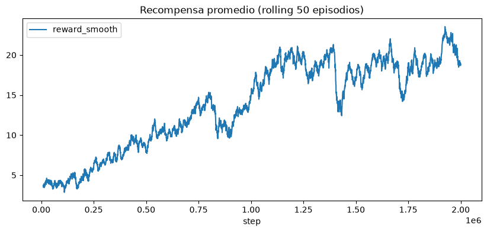
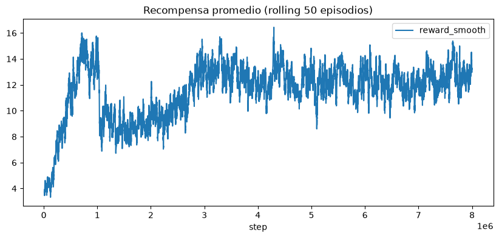

# Proyecto 2: Competencia de Agentes en Space Invaders

**Nombre:** Renato Rojas
**Carné:** 23813
**Repositorio:** https://github.com/Ren23813/proyecto2_deepLearning

## 2.1 Definición del problema y análisis del entorno

**Descripción del entorno.** `ALE/SpaceInvaders-v5` simula el juego de Atari
2600 Space Invaders: el jugador controla un cañón que se mueve
horizontalmente y dispara contra oleadas de invasores alienígenas que
descienden progresivamente, mientras esquiva sus disparos y puede
refugiarse tras búnkeres destructibles. El episodio termina
(`terminated=True`) cuando el jugador pierde sus 3 vidas (partida
completa, evaluación) o pierde 1 vida (entrenamiento, ver más abajo), o
cuando destruye a todos los invasores de la oleada actual y avanza a la
siguiente, más rápida y agresiva; `truncated=True` solo ocurriría si se
alcanzara el límite interno de pasos del entorno, algo que en la práctica
no se observó dentro del `max_steps=100_000` usado en `evaluate.py`
(todos los episodios terminaron por `terminated=True`, es decir, por
pérdida de las 3 vidas).

**Estructura de recompensa.** La recompensa es **dispersa y muy
desbalanceada**: la inmensa mayoría de los pasos individuales dan
recompensa 0, y solo se recibe recompensa positiva al impactar un
invasor (5-30 puntos según la fila) o el OVNI bonus (50-300 puntos,
mucho más grande y raro que el resto). Esto se confirma con los logs de
entrenamiento (`logs/corrida01.csv`, `logs/corrida02.csv`): con
recompensa *clippeada* a {-1,0,+1}, el episodio promedio solo acumula
entre 10 y 13 unidades de recompensa distinta de cero en cientos de
pasos (episodios de 200-1500 pasos de longitud), es decir, un evento de
recompensa positiva cada ~20-30 pasos en promedio. La presencia
ocasional del OVNI bonus (recompensa real de hasta 300, frente a ~5-30
de un invasor normal) es justamente la razón para aplicar reward
clipping (ver abajo): sin él, esos eventos raros dominarían la magnitud
del error de TD y desestabilizarían el entrenamiento.

**Espacio de observación y acción utilizados.**
- Observación: imagen en escala de grises de 84x84 píxeles, con 4 frames
  consecutivos apilados (`AtariPreprocessing` + `FrameStackObservation`,
  ver `wrappers.py`). Se prefirió escala de grises sobre RGB porque el
  color no aporta información relevante para esta tarea (posición de
  invasores, balas y búnkeres se distingue perfectamente en gris) y
  reduce a un tercio el tamaño de entrada de la CNN, acelerando
  entrenamiento e inferencia sin pérdida de desempeño relevante, obtenido de 
  la base de DQN. Apilar 4 frames es
  necesario porque un solo frame es un estado no markoviano para este
  juego: no permite inferir la dirección/velocidad de las balas
  enemigas ni la del propio cañón, información indispensable para
  esquivar.
- Acción: `Discrete(6)` - NOOP, FIRE, RIGHT, LEFT, RIGHTFIRE, LEFTFIRE
  (`full_action_space=False`). Se usó el espacio reducido de 6 acciones
  en vez de las 18 del joystick completo porque las 12 acciones
  adicionales (p. ej. UP, DOWN, diagonales) no tienen ningún efecto en
  Space Invaders al no existir movimiento vertical del cañón; incluirlas
  solo agrandaría inútilmente la capa de salida y el espacio de
  exploración que epsilon-greedy debe cubrir.

**Análisis de la señal de recompensa.** La recompensa de Space Invaders es
dispersa (sparse): la mayoría de los pasos individuales dan recompensa
0, y solo se recibe recompensa positiva al destruir un invasor u OVNI. Se
aplicó reward clipping a {-1, 0, +1} durante el entrenamiento (ver
`wrappers.ClipRewardWrapper`) para evitar que las recompensas grandes
ocasionales (el OVNI bonus) dominen el gradiente y para que la
escala del error de TD (y por lo tanto de la tasa de aprendizaje
efectiva) sea comparable entre distintos juegos de Atari. No se probó reward shaping
adicional (penalizar perder vidas explícitamente): se prefirió
dejar que la señal de recompensa original guíe el aprendizaje y usar en
su lugar `terminal_on_life_loss=True` (ver abajo) para lograr un efecto
similar sin introducir sesgos manuales en la recompensa.

**Decisiones de diseño derivadas del análisis:**
- `terminal_on_life_loss=True` en entrenamiento vs. `False` en
  evaluación: en entrenamiento, terminar el episodio cada vez que se
  pierde una vida corta los episodios (de partidas completas de miles de
  pasos a episodios de un par de cientos) y hace que el `bootstrapping`
  de Double DQN reciba señal de "fin de episodio" con mucha más
  frecuencia, acelerando la propagación del castigo por dejarse golpear.
  En evaluación esto se desactiva porque el criterio de la competencia
  es el puntaje de la partida completa con sus 3 vidas, no de la primera
  vida perdida.
- `repeat_action_probability=0.25` (sticky actions, valor por defecto de
  ALE v5): se mantuvo el default para que el entorno sea estocástico y
  el agente no pueda memorizar una secuencia fija de acciones óptima
  para una semilla en particular, forzándolo a aprender una política
  robusta que generaliza a la variabilidad natural del juego.
- `noop_max=30`: introduce hasta 30 pasos aleatorios de NOOP al inicio de
  cada episodio, variando el estado inicial y evitando que el agente
  memorice la disposición exacta de la primera oleada de invasores.
- `frame_skip=4`: cada acción se repite 4 frames del emulador (con
  max-pooling de los últimos 2 para evitar parpadeo de sprites), el
  valor recomendado para DQN sobre Atari, que reduce el
  costo computacional ~4x sin perder granularidad de control relevante
  para el jugador humano/agente.

## 2.2 Metodología de desarrollo

**Algoritmo(s) considerados.** Se implementó Dueling Double DQN desde
cero en PyTorch. No se comparó contra un DQN vanilla ni contra otros
algoritmos; se fue directo a la combinación Dueling + Double
por ser una mejora incremental bien documentada sobre el DQN clásico del
Laboratorio #5, sin requerir cambiar de familia de algoritmos (on-policy
vs. off-policy) ni la infraestructura de replay buffer ya construida.

**Justificación de la elección.** Double DQN corrige el sesgo de
sobreestimación sistemática de los valores Q que tiene el DQN clásico
(la misma red target selecciona y evalúa la mejor acción siguiente, lo
que tiende a propagar sobreestimaciones ruidosas); su costo de
implementación es mínimo (un forward extra de la red online sobre
`next_obs` en `agent.train_step`, ver `agent.py`). La arquitectura
Dueling ayuda en Space Invaders específicamente porque hay muchos
estados donde el valor del estado es similar sin importar qué acción se
tome (ej. ningún disparo enemigo cerca, ninguna acción es
claramente mejor), y separar V(s) de A(s,a) permite aprender esa señal
de valor de forma más eficiente en muestras que un DQN con una sola
cabeza de salida.

**Arquitectura de la red** (ver `src/model.py`):
- Entrada: (4, 84, 84), normalizada a [0, 1].
- 3 capas convolucionales: 32@8x8/4, 64@4x4/2, 64@3x3/1, todas con ReLU.
- Capa densa compartida de 512 unidades (ReLU).
- Dos cabezas: Value (512→512→1) y Advantage (512→512→n_acciones).
- Combinación: Q(s,a) = V(s) + (A(s,a) − media_a' A(s,a')).
- 2,213,031 parámetros entrenables en total (calculado con
  `python model.py`).

No se probaron variaciones de arquitectura (batch normalization, más/menos
filtros, más capas densas): se mantuvo la arquitectura convolucional
estándar recomendada para DQN con la modificación dueling, y
las iteraciones del proyecto se enfocaron en el presupuesto de pasos de
entrenamiento en lugar de en la arquitectura.

**Estrategia de exploración vs. explotación.** Epsilon-greedy con
decaimiento lineal de ε=1.0 a ε=0.1 en 1,000,000 de pasos, seguido de un
valor constante de 0.1 durante el resto del entrenamiento (ver
`linear_epsilon` en `train.py`). No se probaron estrategias alternativas
(Boltzmann/softmax, NoisyNets); se usó el esquema estándar de la
literatura de DQN sobre Atari. En la corrida02 (8M pasos, ver sección
2.3) el entrenamiento se interrumpió y se reanudó (`--resume-from`)
cerca del paso 1,000,000, pues ya había decaído el valor de épsilon, pero se pretendía
decayera hasta llegar al paso 3M; esto se corrigió reanudando de nuevo con el
flag `--resume-step-override` para forzar el step real y que epsilon
retomara su decaimiento lineal correcto esperado.

**Hiperparámetros de entrenamiento** (corrida final, `corrida02`, la que
se usó para generar los videos de evaluación y competencia):

| Hiperparámetro | Valor |
|---|---|
| Función de pérdida | Huber (SmoothL1Loss) |
| Optimizador | Adam |
| Tasa de aprendizaje | 1e-4 |
| Tamaño de replay buffer | 100,000 transiciones |
| Tamaño de batch | 32 |
| Frecuencia de actualización de la red target | cada 10,000 pasos (hard update) |
| Factor de descuento (γ) | 0.99 |
| Pasos de calentamiento (learning starts) | 50,000 |
| Frecuencia de entrenamiento (train_freq) | cada 4 pasos |
| Programa de epsilon | 1.0 → 0.1 lineal en 1,000,000 pasos |
| n-step returns | 1 (DQN clásico de 1 paso) |
| Total de pasos de entrenamiento | 8,000,000 (con un reinicio/resume cerca del paso 1M) |
| Hardware utilizado | Google Colab, GPU NVIDIA T4 |
| Tiempo total de entrenamiento | ≈ 10h |

La corrida01 (2,000,000 pasos, entrenada localmente en una GPU NVIDIA
RTX 4060 en ≈ 81 minutos / 4,872 s) usó los mismos hiperparámetros de la
tabla anterior salvo el total de pasos, y sirvió como corrida base antes
de escalar a 8M pasos en Colab.

## 2.3 Resultados de iteraciones

| Iteración | Cambios respecto a la anterior | Recompensa promedio (entrenamiento, clippeada) | Recompensa evaluación greedy | Observaciones |
|---|---|---|---|---|
| 1 — `corrida01` | Configuración base (Dueling Double DQN, hiperparámetros por defecto de `train.py`), 2,000,000 pasos, local (RTX 4060) | 12.37 (promedio de los 6,661 episodios); 20.88 en los últimos 200 episodios | Videos en eval_corrida01/ | Corrida de validación del pipeline completo antes de escalar el número de pasos en Colab. |
| 2 — `corrida02` | Mismos hiperparámetros, escalado a 8,000,000 pasos en Google Colab (T4); entrenamiento interrumpido y reanudado (`--resume-from`) cerca del paso 1,000,000 | 11.28 (promedio de los 24,237 episodios); 12.97 en los últimos 200 episodios | Mejor episodio individual: **975 puntos** (`videos/eval_corrida02/space_invaders_dqn-episode-10.mp4`, sobre 15 episodios grabados con `evaluate.py`) | Iteración usada para el checkpoint final del proyecto (`corrida02_final.pt`). |
| 3 — Competencia en clase | Mismo checkpoint de la iteración 2 (`corrida02_final.pt`), evaluado en las 5 partidas oficiales de la competencia | — (no aplica, sin re-entrenamiento) | Máximo de las 5 partidas oficiales: **590 puntos** (`videos/presentacion/space_invaders_dqn-episode-0.mp4`) | Puntaje de competencia menor al mejor episodio visto en evaluación local por la varianza propia del entorno (sticky actions) y la mala suerte en el sorteo de las 5 partidas permitidas; no representa una regresión del agente. |

Nota sobre la métrica de "recompensa promedio de entrenamiento": es la
recompensa clippeada a {-1,0,+1} que reporta `train.py` en
`logs/<run_name>.csv`, útil para monitorear la estabilidad del
aprendizaje, pero no comparable con el puntaje real del juego, que
solo se mide con `evaluate.py` (sin clipping, sin `terminal_on_life_loss`)
y es el criterio oficial de la competencia (columnas "evaluación greedy").

**Curvas de entrenamiento.** 
La primera realizada, local, con 2 millones de pasos:

La segunda realizada, en Google Colab, con 8 millones de pasos: 

**Problemas encontrados durante el entrenamiento.** Con el de Google Colab, se tuvo un error con el parámetro de 
decaimiento de épsilon, pues al ser 8M de pasos, se pretendía que tuviera decaimiento hasta el paso 3M, pero se 
olvidó cambiar el hiperparámetro y se corrió el primer millón de pasos con decaimiento hasta dicho millón. Se tuvo
que continuar el entrenamiento, pero con el épsilon decayente hasta los 3M pasos. Por eso se ve una alta caída
en el modelo en ese paso del segundo entrenamiento, pues es debido a un error humano al momento de entrenarlo.   
Además, por alguna razón, el entorno de google detectaba desconexión durante el entrenamiento, haciendo que el 
servidor estuviera pausado durante un par de minutos al momento de entrenarse. 

## 2.4 Discusión de resultados

- **Comparación entre iteraciones:** el cambio con mayor impacto fue,
  claramente, la cantidad de pasos de entrenamiento: pasar de 2M
  (`corrida01`) a 8M pasos (`corrida02`) es lo único que se varió entre
  ambas corridas (misma arquitectura, mismos hiperparámetros) y es lo
  que permitió pasar de un agente que apenas terminaba de calentar (el
  decaimiento de epsilon termina en el paso 1M) a uno con varios
  millones de pasos de explotación pura para refinar la política. No se
  llegó a experimentar con la arquitectura o el preprocesamiento porque
  el cuello de botella de este proyecto fue el tiempo de cómputo
  disponible, no la calidad del algoritmo.
- **Análisis cualitativo del agente final:** en los videos de
  evaluación (`videos/eval_corrida02/`) el agente muestra una estrategia
  claramente dirigida: se posiciona debajo de columnas de invasores
  antes de disparar en vez de disparar a ciegas, y usa los búnkeres como
  cobertura moviéndose lateralmente para esquivar disparos entrantes. 
  Prefiere colocarse en los lados izquierdos y derechos del mapa, en vez del centro. 
  Falla al avanzar el nivel, pues las naves son más rápidas (cuando
  quedan pocos invasores, estos descienden y disparan mucho más rápido)
  y en reaccionar de forma consistente al OVNI bonus, que aparece
  brevemente y de forma poco frecuente en el buffer de entrenamiento
  frente a los invasores normales; le dispara ocasionalmente, pero no lo prioriza.
- **Limitaciones del enfoque y del cómputo disponible:** 8,000,000 de
  pasos de entorno es un orden de magnitud menor que los ~200 millones
  de frames usados en el paper original de DQN para
  alcanzar desempeño reportado como "nivel humano" en Atari. Con el
  hardware disponible (RTX 4060 local: 2M pasos en ~81 min; Colab T4:
  8M pasos en ~10h, con desconexiones que obligan a usar
  `--resume-from`), escalar más el número de pasos habría requerido
  varias sesiones adicionales de Colab (se usaron 2) o acceso a una GPU dedicada por
  más tiempo continuo, algo fuera del alcance de este proyecto y de la economía (es pay to win).
- **Trade-off exploración/explotación observado:** sí se observó mejora
  clara al bajar epsilon: la recompensa promedio de entrenamiento (aun
  clippeada) subió de 12.37 en promedio general a 20.88 en los últimos
  200 episodios de `corrida01`, ya con epsilon en su piso de 0.1. En
  `corrida02` el efecto es menos marcado (11.28 general vs. 12.97 en los
  últimos 200 episodios) posiblemente por la varianza introducida por el
  reinicio con epsilon mal calculado a mitad de camino, que retrasó
  varios cientos de miles de pasos de explotación "limpia".

## 2.5 Conclusiones

- **Desempeño final:** el mejor episodio individual observado con el
  checkpoint final (`corrida02_final.pt`) fue de **975 puntos** en
  evaluación local (`videos/eval_corrida02/space_invaders_dqn-episode-10.mp4`);
  en las 5 partidas oficiales de la competencia en clase, con el mismo
  checkpoint, el máximo fue de **590 puntos**
  (`videos/presentacion/space_invaders_dqn-episode-0.mp4`), por debajo
  del techo demostrado en evaluación debido a la varianza propia de las
  sticky actions y a la mala suerte en el sorteo de esas 5 partidas
  puntuales, no a una diferencia real de política. En el contexto del juego, un puntaje de 975 implica
  limpiar casi toda la primera oleada (nivel) del juego, impactando también en el OVNI bonus. 
- **Principales aprendizajes técnicos y metodológicos:** (1) la cantidad
  de pasos de entrenamiento fue, con diferencia, la variable de mayor
  impacto en este proyecto, más que cualquier detalle de arquitectura;
  (2) entrenar en sesiones de Colab que se desconectan exige diseñar
  desde el inicio un mecanismo robusto de checkpointing y resume (paso,
  episodio, estado del optimizador), y un descuido ahí (epsilon mal
  recalculado al reanudar) puede introducir ruido difícil de diagnosticar
  sin revisar los logs con cuidado; (3) separar claramente el entorno de
  entrenamiento (con reward clipping y `terminal_on_life_loss`) del de
  evaluación (recompensa real, partida completa) es indispensable para no
  confundir la métrica interna de aprendizaje con el puntaje real de
  competencia.
- **Trabajo futuro:** Prioritized Experience Replay (para muestrear más
  seguido las transiciones raras del OVNI bonus), probar `n-step` returns
  \>1 (ya soportado por `train.py` pero no usado en las corridas
  reportadas), entrenar por más pasos con `target-update-mode soft`, y
  automatizar el respaldo a Google Drive (`--drive-sync-dir`) desde el
  inicio de cada corrida en Colab para no depender de guardar
  manualmente checkpoints de emergencia ante una desconexión.

## 2.6 Enlace al repositorio de GitHub

Repositorio: https://github.com/Ren23813/proyecto2_deepLearning

El repositorio incluye:
- Código de preprocesamiento, entrenamiento, evaluación y generación de
  video (`src/`).
- Notebook de demostración (`notebooks/`).
- `README.md` con instrucciones completas de reproducción y de cómo cargar
  los pesos del modelo final.
- Checkpoints del modelo final (`checkpoints/`) - si el archivo es muy
  grande para GitHub, incluir un enlace de descarga (Google Drive, etc.) en
  el README.
